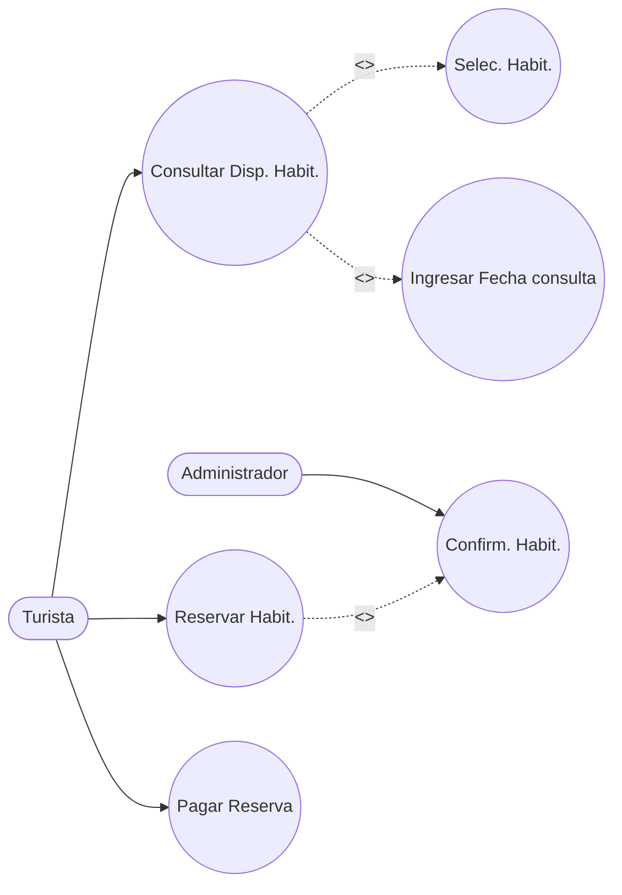

# Vista de Escenario (Modelo UML 4+1)

Este diagrama representa la Vista de Escenario, modelada mediante un **Diagrama de Casos de Uso**.

```mermaid
flowchart LR
    %% Actores
    Turista(["Turista"])
    Administrador(["Administrador"])
    
    %% Casos de Uso
    UC_Disp((Consultar Disp. Habit.))
    UC_Sel((Selec. Habit.))
    UC_Fechas((Ingresar Fecha consulta))
    UC_Res((Reservar Habit.))
    UC_Conf((Confirm. Habit.))
    UC_Pago((Pagar Reserva))
    
    %% Relaciones
    Turista --> UC_Disp
    Turista --> UC_Res
    Turista --> UC_Pago
    
    Administrador --> UC_Conf
    
    UC_Disp -.->|<<include>>| UC_Sel
    UC_Disp -.->|<<extend>>| UC_Fechas
    UC_Res -.->|<<include>>| UC_Conf
```
