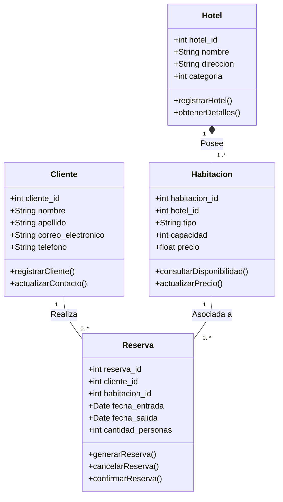

# Vista Lógica (Modelo UML 4+1)

Este diagrama representa la Vista Lógica, modelada mediante un **Diagrama de Clases**.

```mermaid
classDiagram
    class Hotel {
        +int hotel_id
        +String nombre
        +String direccion
        +int categoria
        +registrarHotel()
        +obtenerDetalles()
    }
    
    class Habitacion {
        +int habitacion_id
        +int hotel_id
        +String tipo
        +int capacidad
        +float precio
        +consultarDisponibilidad()
        +actualizarPrecio()
    }
    
    class Cliente {
        +int cliente_id
        +String nombre
        +String apellido
        +String correo_electronico
        +String telefono
        +registrarCliente()
        +actualizarContacto()
    }
    
    class Reserva {
        +int reserva_id
        +int cliente_id
        +int habitacion_id
        +Date fecha_entrada
        +Date fecha_salida
        +int cantidad_personas
        +generarReserva()
        +cancelarReserva()
        +confirmarReserva()
    }
    
    Hotel "1" *-- "1..*" Habitacion : Posee
    Cliente "1" -- "0..*" Reserva : Realiza
    Habitacion "1" -- "0..*" Reserva : Asociada a
```
