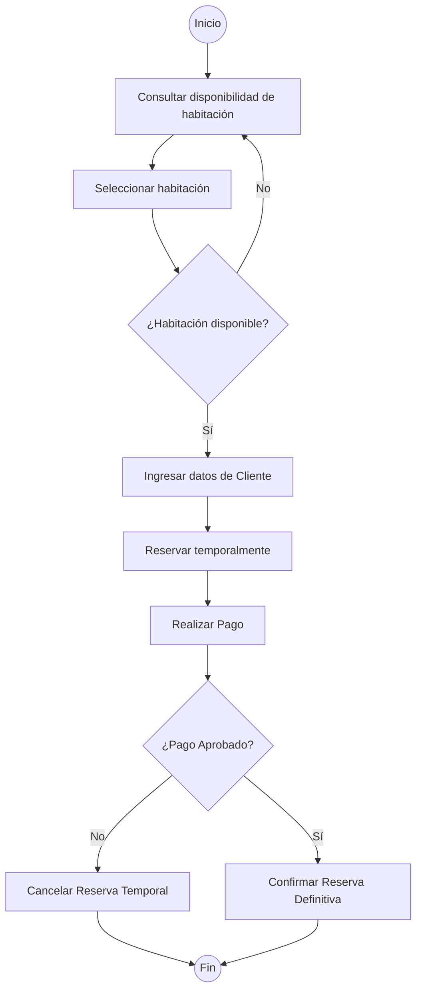

# Vista de Proceso (Modelo UML 4+1)

Este diagrama representa la Vista de Proceso, modelada mediante un **Diagrama de Actividad**.

```mermaid
flowchart TD
    %% Inicio y Fin
    Start((Inicio))
    End((Fin))
    
    %% Actividades
    Search[Consultar disponibilidad de habitación]
    Select[Seleccionar habitación]
    Auth[Ingresar datos de Cliente]
    Check{¿Habitación disponible?}
    TempReserve[Reservar temporalmente]
    Payment[Realizar Pago]
    PayCheck{¿Pago Aprobado?}
    Confirm[Confirmar Reserva Definitiva]
    Cancel[Cancelar Reserva Temporal]
    
    %% Flujo
    Start --> Search
    Search --> Select
    Select --> Check
    Check -->|No| Search
    Check -->|Sí| Auth
    Auth --> TempReserve
    TempReserve --> Payment
    Payment --> PayCheck
    PayCheck -->|No| Cancel
    Cancel --> End
    PayCheck -->|Sí| Confirm
    Confirm --> End
```
