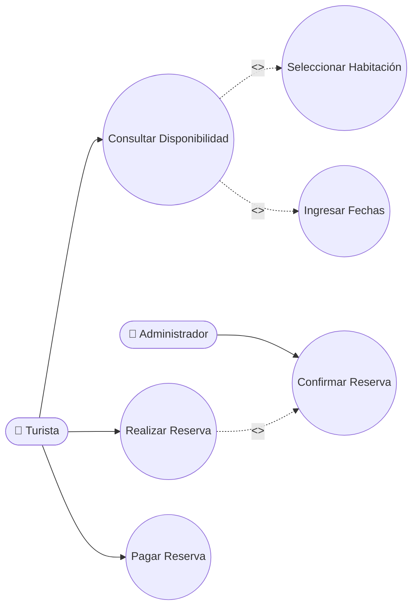
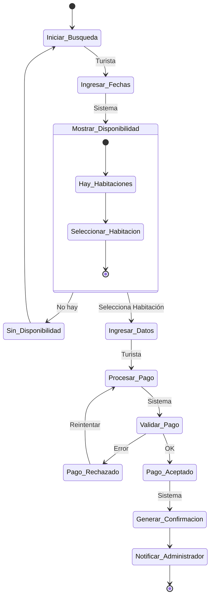
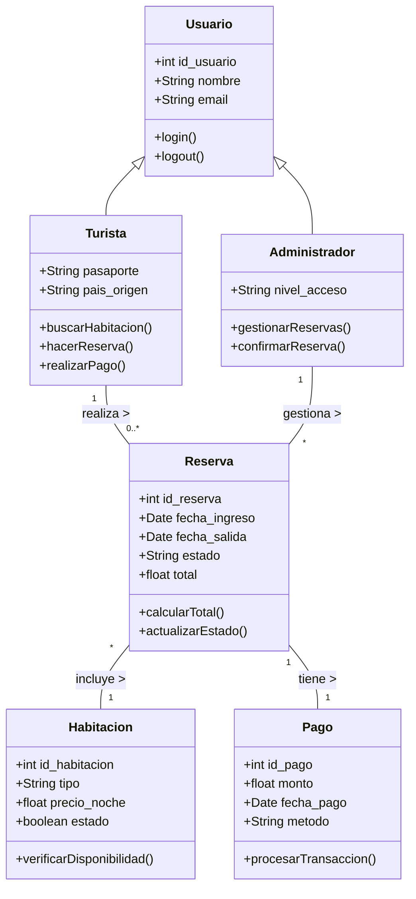
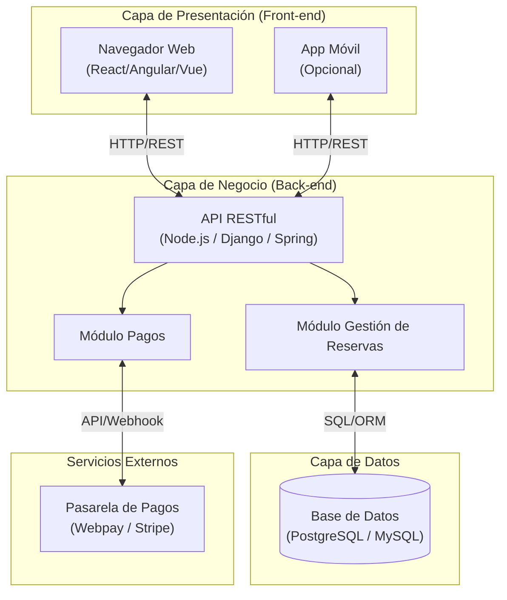

# Diagramas UML - Vistas del Sistema de Reservas

## 1. Vista de Escenario (Diagrama de Caso de Uso)
Muestra los actores principales y cómo interactúan con los casos de uso fundamentales del sistema de reservas.

```mermaid
usecaseDiagram
    actor Turista
    actor Administrador

    package "Sistema de Reservas" {
        usecase "Consultar Disponibilidad" as UC1
        usecase "Seleccionar Habitación" as UC2
        usecase "Ingresar Fechas" as UC3
        usecase "Realizar Reserva" as UC4
        usecase "Pagar Reserva" as UC5
        usecase "Confirmar Reserva" as UC6
    }

    Turista --> UC1
    Turista --> UC4
    Turista --> UC5

    Administrador --> UC6

    UC1 ..> UC2 : <<include>>
    UC1 ..> UC3 : <<extend>>
    UC4 ..> UC6 : <<include>>
```

*Nota: Github soporta sintaxis flowchart si usecaseDiagram no renderiza nativamente en algunas herramientas, aquí la versión alternativa en flowchart:*



## 2. Vista de Procesos (Diagrama de Actividad)
Representa el flujo de trabajo para el proceso principal de "Realizar y Pagar una Reserva".



## 3. Vista Lógica (Diagrama de Clases)
Muestra la estructura de los objetos principales, sus atributos y relaciones.



## 4. Vista de Despliegue (Diagrama de Componentes / Despliegue)
Muestra cómo se distribuirá el sistema en la infraestructura física (servidores, base de datos).


