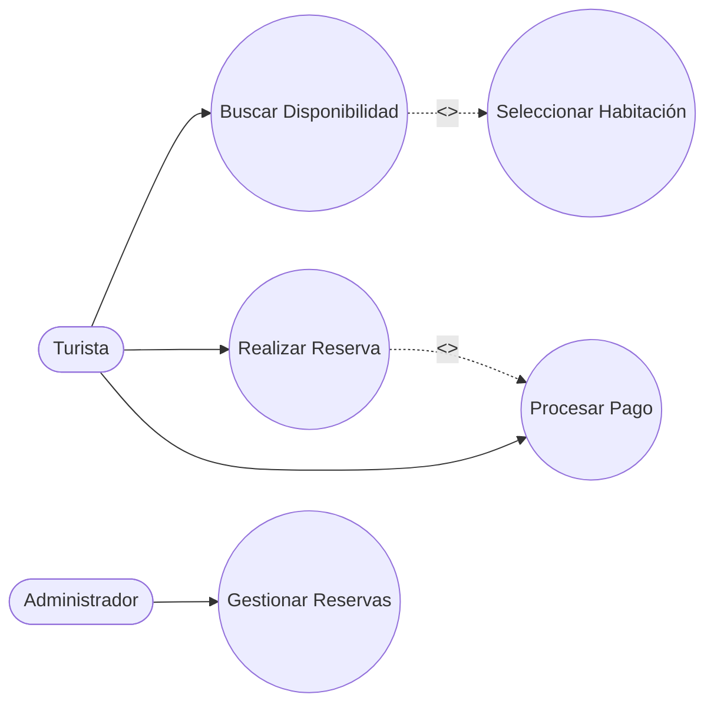
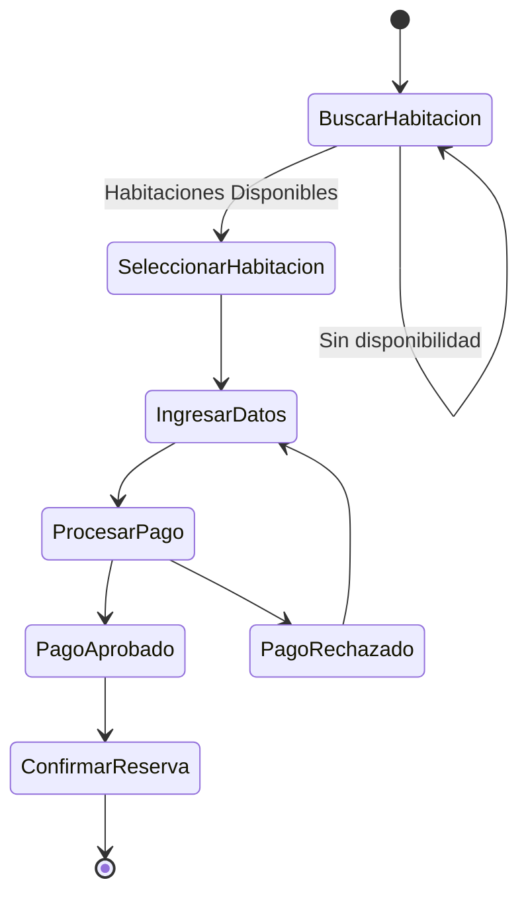
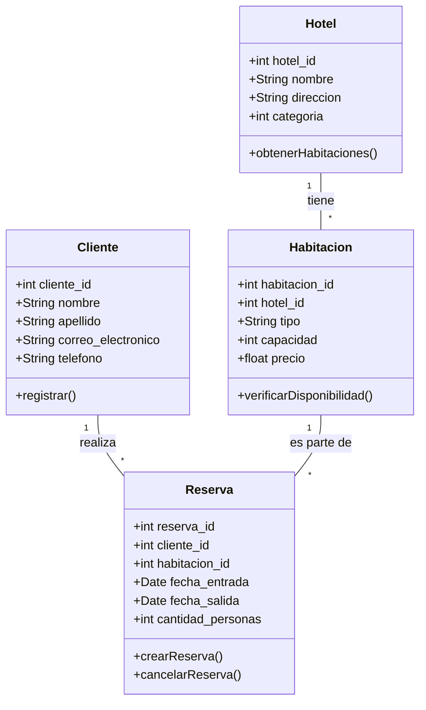
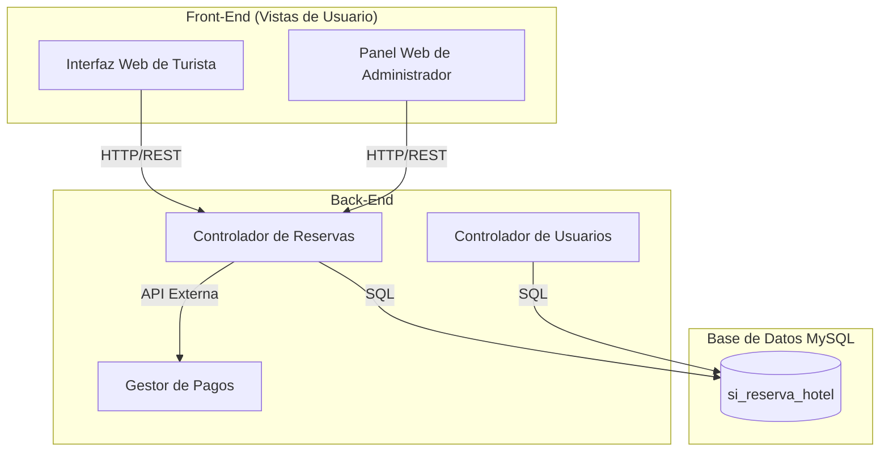

# Modelos UML Actualizados (Semana 5)

A continuación se presentan los diagramas correspondientes al estándar 4+1, con mejoras respecto a la semana anterior y la adición del diagrama de componentes.

## 1. Vista de Escenario (Casos de Uso)
*Mejora: Se agregan detalles para la gestión del sistema de reservas.*

## 2. Vista de Procesos (Diagrama de Actividad)
*Proceso de reserva de habitación.*

## 3. Vista Lógica (Diagrama de Clases)
*Mejora: Adición de métodos y tipos de datos coherentes con la Base de Datos.*

## 4. Vista de Despliegue (Diagrama de Componentes)
*Nueva vista solicitada en S5.*

