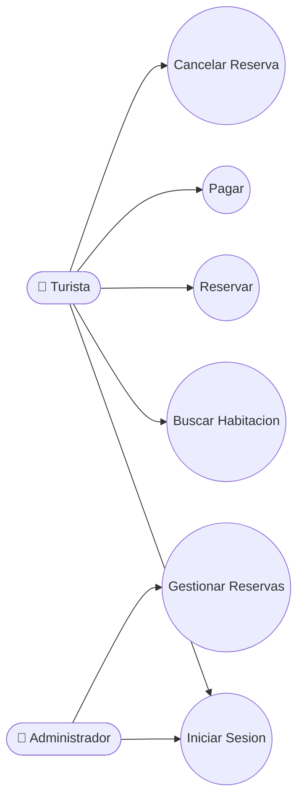
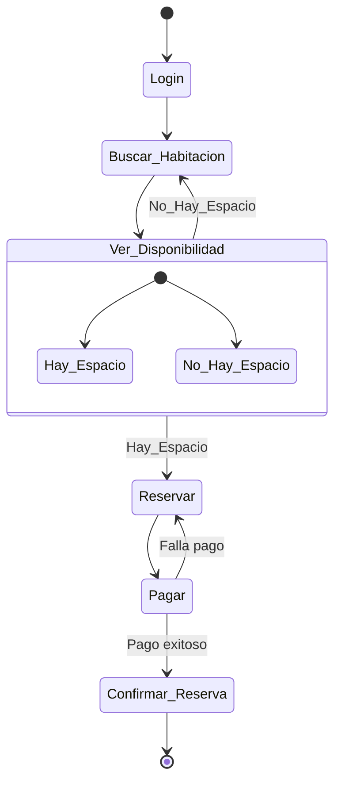
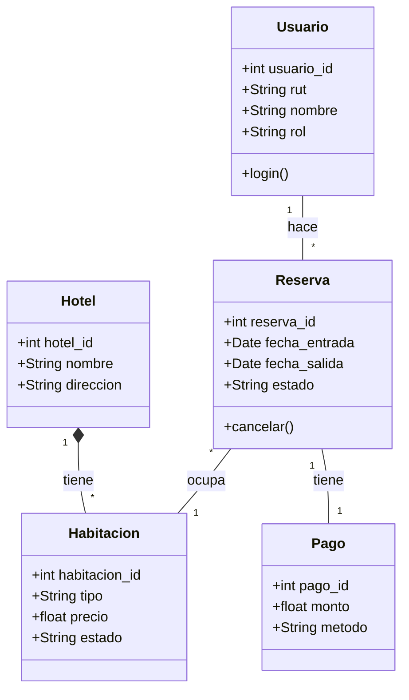
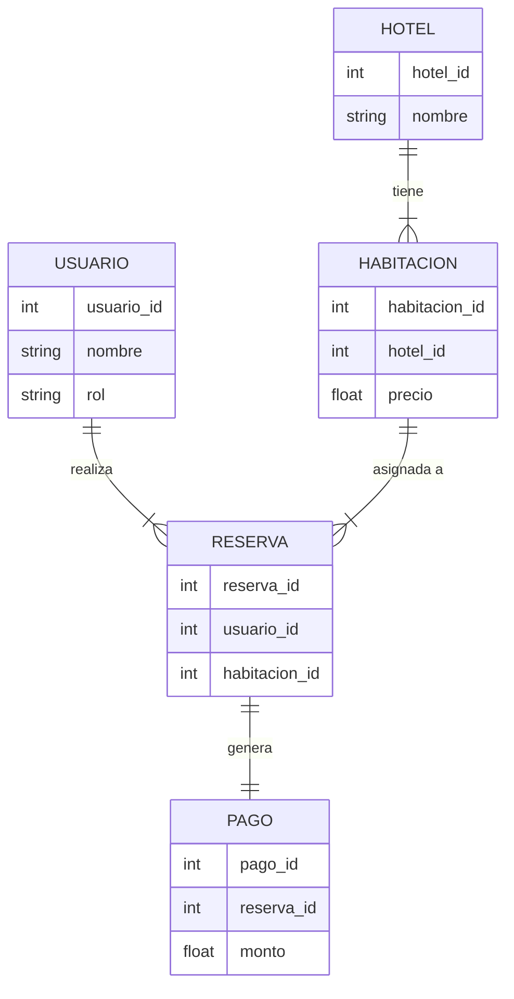

# Diagramas UML (Actualizados Semana 6)

Mejoras a los diagramas en base a lo anterior, agregando inicio de sesion y la cancelacion.

## Vista de Escenario (Caso de Uso)

## Vista de Proceso (Actividad)

## Vista Logica (Clases)

## Diagrama de Base de Datos (ER)

